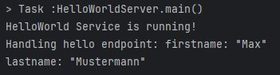

# MidEng 7.2 gRPC Framework
Author: Lukas Schrenk

## Assessment
This task help getting to know the Remote Procedure Call (RPC) Technology with the Framwork gRPC.
For a GKue a finished Hello World Programm is needed and for GKv a simle Election Data should be transfered

## Implementation
### GKü
The first step is to set up a Gradle Project. In there add the 3 files of the Hello World sorce files and the hello.proto.
Important is that to creat a new folder called "proto". However, that everything works download the Github repository as a zip file
and add it to the library in Intellij ("Crt+alt+shift+s"). Then important changes need to be done on the 
build.gradle file. 

``` java
plugins {
    id 'java'
    id 'com.google.protobuf' version '0.9.4' //to add
}

repositories {
    mavenCentral()
}

dependencies {
    implementation 'io.grpc:grpc-netty:1.68.1' //to add
    implementation 'io.grpc:grpc-protobuf:1.68.1' //to add
    implementation 'io.grpc:grpc-stub:1.68.1' //to add
    implementation 'io.grpc:grpc-api:1.68.1' //to add
    compileOnly 'javax.annotation:javax.annotation-api:1.3.2' //to add
}

//to add
protobuf {
    protoc {
        artifact = "com.google.protobuf:protoc:3.25.5"
    }
    plugins {
        grpc {
            artifact = 'io.grpc:protoc-gen-grpc-java:1.68.1'
        }
    }
    generateProtoTasks {
        all().each { task ->
            task.plugins {
                grpc {}
            }
        }
    }
}

sourceSets {
    main {
        java {
            srcDir 'build/generated/source/proto/main/java'
            srcDir 'build/generated/source/proto/main/grpc'
        }
    }
}
```
Next changes which need to be done are those to lines in hello.proto
```
option java_package = "org.example";
option java_outer_classname = "Hello";
```

To run the Hello world Applikation build everything with `gradle build` first and then run the Server.
When running the Client the data should be shown in the cmd.



#### Problems may encountering
- It is really important to use the suiting Versions. 
- without `sourceSets` it won't work
- ! It is not clear in every tutorial which depndencies are needed. At the Github Repository following are shown to add:
```
runtimeOnly 'io.grpc:grpc-netty-shaded:1.68.1'
implementation 'io.grpc:grpc-protobuf:1.68.1'
implementation 'io.grpc:grpc-stub:1.68.1'
compileOnly 'org.apache.tomcat:annotations-api:6.0.53' // necessary for Java 9+
```
These are necessary as well however `implementation 'io.grpc:grpc-api:1.68.1'` is missing. 
Without this the imports won't get recognized.

#### Questions
##### What is gRPC and why does it work accross languages and platforms? 
gRPC is an open-source, high-performance framework for Remote Procedure Calls (RPC) that enables client-server communication.
It uses Protocol Buffers for defining interfaces and data serialization, allowing code generation in multiple languages.
HTTP/2 as a transport protocol provides features like bidirectional streaming, making gRPC versatile across languages and platforms.

##### Describe the RPC life cycle starting with the RPC client?
The client initiates a call to the server's remote method, sending a request message.
The server receives the request, processes it, and sends a response message back to the client
. Depending on the RPC type, this can be a single message, a stream, or bidirectional 
communication, all managed by gRPC.


##### Describe the workflow of Protocol Buffers?
Protocol Buffers define message schemas in .proto files, which are compiled to generate language-specific classes. 
These classes handle data serialization and deserialization, enabling efficient
encoding of structured data for network transmission.


##### When is the use of protocol not recommended?
Protocol Buffers are not recommended for human-readable data formats, small data sets, 
or applications requiring extensive backward compatibility without recompilation.


##### List 3 different data types that can be used with protocol buffers?
1. int32 for integers
2. string for text
3. bool for boolean values

### GKv
To send a record of Election Data new files need to be added. The important one is a new election.proto File and a class
which has the data structure. Then we need a new client and Impl class and as well we need to change the server class.
The easiest part is to change the server because it just needs to add a new service:
``` java
  public void start() throws IOException {
        server = ServerBuilder.forPort(PORT)
                .addService(new HelloWorldServiceImpl())     // Register HelloWorld service
                .addService(new ElectionServiceImpl())       // Register Election service
                .build()
                .start();

        System.out.println("Server started, listening on port " + PORT);
    }
```
Now the server can work with both, HelloWorld and Election <br>
Next is the ElectionData class which is small construct how the ElectionData is represented.
```java
    private String regionID;
    private String regionName;
    private String regionAddress;
    private String regionPostalCode;
    private String federalState;
    private String timestamp;
    private List<Party> countingData;
```
The most important thing is that the attributes are correct. The class Party is to create as well, however, it is rather
small and needs just 2 attributes, name and votes.
<br>
The next class which is needed is the ElectionServiceImpl.java. It gets the Data, so it can print it out.
```java
 public void transferElectionData(ElectionDataRequest request, StreamObserver<ElectionDataResponse> responseObserver) {
        ElectionData data = request.getData();

        System.out.println("Received election data for region: " + data.getRegionName());
        System.out.println("Timestamp: " + data.getTimestamp());

        for (ElectionProto.Party party : data.getCountingDataList()) {
            System.out.println("Party: " + party.getPartyID() + ", Votes: " + party.getAmountVotes());
        }

        ElectionDataResponse response = ElectionDataResponse.newBuilder()
                .setMessage("Election data received successfully for region: " + data.getRegionName())
                .build();

        responseObserver.onNext(response);
        responseObserver.onCompleted();
    }
```
The last important class is the ElectionClient class. This sends the data. <br>
First Step, it creates the Data for "Linz Bahnhof"
```java
    private ElectionData createElectionData() {
        ElectionData.Builder dataBuilder = ElectionData.newBuilder();

        dataBuilder.setRegionID("33123")
                .setRegionName("Linz Bahnhof")
                .setRegionAddress("Bahnhofsstrasse 27/9")
                .setRegionPostalCode("4020")
                .setFederalState("Austria")
                .setTimestamp("2024-09-12 11:48:21");

        dataBuilder.addCountingData(
                Party.newBuilder().setPartyID("OEVP").setAmountVotes(322).build()
        );
        dataBuilder.addCountingData(
                Party.newBuilder().setPartyID("SPOE").setAmountVotes(301).build()
        );
        dataBuilder.addCountingData(
                Party.newBuilder().setPartyID("FPOE").setAmountVotes(231).build()
        );
        dataBuilder.addCountingData(
                Party.newBuilder().setPartyID("GRUENE").setAmountVotes(211).build()
        );
        dataBuilder.addCountingData(
                Party.newBuilder().setPartyID("NEOS").setAmountVotes(182).build()
        );

        return dataBuilder.build();
    }
```
Then, it sends it.
```java
public void sendElectionData() {
        ElectionData data = createElectionData();
        ElectionDataRequest request = ElectionDataRequest.newBuilder()
                .setData(data)
                .build();

        ElectionDataResponse response = blockingStub.transferElectionData(request);
        System.out.println("Response from server: " + response.getMessage());
    }
```


## Sources
https://central.sonatype.com/ [Sonatype Central, 2024-11-11]

https://github.com/grpc/grpc-java?tab=readme-ov-file [GitHub, 2024-11-11]

https://grpc.io/docs/languages/java/generated-code/ [gRPC Documentation, 2024-11-11]

https://grpc.github.io/grpc-java/javadoc/io/grpc/ManagedChannel.html [gRPC Javadoc, 2024-11-11]

https://intuting.medium.com/implement-grpc-service-using-java-gradle-7a54258b60b8 [Medium, 2024-11-11]

https://grpc.io/docs/languages/java/basics/ [gRPC Documentation, 2024-11-11]

https://yidongnan.github.io/grpc-spring-boot-starter/en/server/getting-started.html [gRPC Spring Boot Starter, 2024-11-11]
